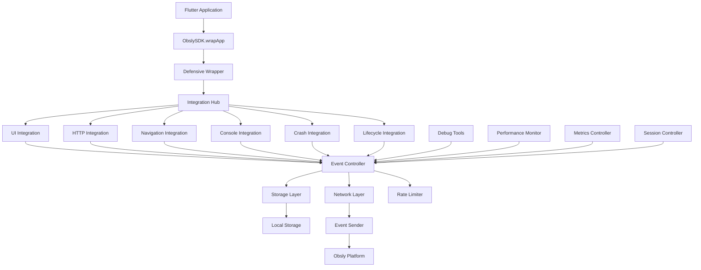

# Arquitectura del Obsly Flutter SDK

## Visión General de la Arquitectura

Obsly Flutter SDK está diseñado con una arquitectura modular y defensiva que garantiza que nunca interrumpa el funcionamiento de la aplicación host, sin importar qué errores puedan ocurrir internamente.

## Principios de Diseño

### 🛡️ Defensive Programming
- **Zero Breaking**: El SDK nunca debe causar crashes en la app host
- **Graceful Fallback**: Si algo falla, la app continúa funcionando normalmente
- **Error Isolation**: Los errores del SDK se capturan y manejan internamente

### 🔧 Modularidad
- **Single Responsibility**: Cada componente tiene una responsabilidad específica
- **Loose Coupling**: Los módulos interactúan a través de interfaces bien definidas
- **High Cohesion**: Funcionalidades relacionadas están agrupadas

### ⚡ Performance First
- **Lazy Loading**: Los componentes se inicializan solo cuando se necesitan
- **Background Processing**: Las operaciones pesadas se ejecutan en background
- **Rate Limiting**: Control automático para evitar sobrecarga

## Diagrama de Arquitectura



## Componentes Principales

### 1. Punto de Entrada (Entry Point)

#### ObslySDK Class
- **Ubicación**: `lib/obsly_sdk.dart`
- **Propósito**: API pública unificada
- **Patrón**: Singleton con API estática de conveniencia

```dart
// API Simple
Widget app = ObslySdk.wrapApp(
  Widget app, {
  required String apiKey,
  // ... otros parámetros
});

// API Completa  
await ObslySDK.instance.init(InitParameters(...));
Widget wrapped = ObslySDK.instance.wrapApp(app: myApp);
```

#### Defensive Wrapper
- **Ubicación**: `lib/obsly_sdk.dart` (_DefensiveWrapper)
- **Propósito**: Garantizar que fallos del SDK no afecten la app
- **Características**:
  - Try-catch en todos los niveles
  - Fallback automático a la app original
  - Logging defensivo de errores

### 2. Capa de Configuración

#### ConfigController
- **Ubicación**: `lib/config/config_controller.dart`
- **Propósito**: Gestión centralizada de configuración
- **Características**:
  - Configuración local + remota
  - Hot reload de configuración
  - Validación automática

#### ObslyConfig
- **Ubicación**: `lib/models/obsly_config.dart`
- **Propósito**: Modelo de configuración tipado
- **Incluye**:
  - Configuración de interceptors
  - Rate limits
  - Configuración de debug tools

### 3. Sistema de Integraciones

#### Integration Hub (ObslyHub)
- **Ubicación**: `lib/interceptors/obsly_hub.dart`
- **Propósito**: Punto central para manejar eventos de todas las integraciones
- **Patrón**: Hub and Spoke

#### Integraciones Disponibles

##### UI Integration
- **Ubicación**: `lib/interceptors/ui_integration.dart`
- **Captura**: Taps, gestures, widget interactions
- **Tecnología**: Widget wrapping y GestureDetector override

##### HTTP Integration
- **Ubicación**: `lib/interceptors/http_integration.dart`
- **Captura**: Requests, responses, errores HTTP
- **Tecnología**: 
  - **Web**: Client wrapper con interceptors
  - **Mobile**: HttpOverrides para captura automática

##### Navigation Integration
- **Ubicación**: `lib/interceptors/navigation_integration.dart`
- **Captura**: Route changes, navigation events
- **Tecnología**: NavigatorObserver

##### Console Integration
- **Ubicación**: `lib/interceptors/console_integration.dart`
- **Captura**: print(), debugPrint(), log messages
- **Tecnología**: Zone override para captura de console

##### Crash Integration
- **Ubicación**: `lib/interceptors/crash_integration.dart`
- **Captura**: Uncaught exceptions, Flutter errors
- **Tecnología**: 
  - FlutterError.onError override
  - Zone.runGuarded para async errors

##### Lifecycle Integration
- **Ubicación**: `lib/interceptors/app_lifecycle_integration.dart`
- **Captura**: App state changes (foreground/background)
- **Tecnología**: WidgetsBindingObserver

### 4. Controladores de Eventos

#### Event Controller
- **Ubicación**: `lib/controllers/event_controller.dart`
- **Propósito**: Procesamiento central de todos los eventos
- **Responsabilidades**:
  - Queue management
  - Rate limiting
  - Batch processing
  - Retry logic

#### Performance Controller
- **Ubicación**: `lib/controllers/performance_controller.dart`
- **Propósito**: Gestión de transactions y steps
- **Características**:
  - Nested transactions
  - Automatic timing
  - Performance metrics

#### Metrics Controller
- **Ubicación**: `lib/controllers/metrics_controller.dart`
- **Propósito**: Manejo de métricas (counters, gauges, histograms)
- **Características**:
  - Type safety
  - Automatic aggregation
  - Time-based metrics

#### Session Controller
- **Ubicación**: `lib/controllers/session_controller.dart`
- **Propósito**: Gestión de sesiones de usuario
- **Características**:
  - Automatic timeout
  - Session persistence
  - Custom session IDs

### 5. Capa de Storage

#### Obsly Storage
- **Ubicación**: `lib/storage/obsly_storage.dart`
- **Propósito**: Persistencia local de eventos y configuración
- **Tecnología**: Hive (key-value store)
- **Características**:
  - Platform agnostic
  - Efficient serialization
  - Automatic cleanup

#### Session Storage
- **Ubicación**: `lib/storage/session_storage.dart`
- **Propósito**: Estado de sesión en memoria
- **Incluye**:
  - Current view/operation/functional block
  - Session metadata
  - Temporary state

### 6. Capa de Red

#### Event Sender
- **Ubicación**: `lib/network/event_sender.dart`
- **Propósito**: Envío de eventos al servidor Obsly
- **Características**:
  - Batch sending
  - Retry with exponential backoff
  - Network state awareness
  - Connection validation

#### API Client
- **Ubicación**: `lib/network/obsly_api_client.dart`
- **Propósito**: Cliente HTTP especializado para la API de Obsly
- **Características**:
  - Authentication handling
  - Error handling
  - Response parsing

### 7. Utilidades

#### ID Manager
- **Ubicación**: `lib/utils/id_manager/`
- **Propósito**: Gestión de identificadores únicos
- **IDs Gestionados**:
  - Installation ID (persistent)
  - Session ID (per session)
  - Execution ID (per app launch)
  - User ID (configurable)
  - Person ID, Passport ID, Contract ID

#### Device Info Collector
- **Ubicación**: `lib/utils/device_info_collector.dart`
- **Propósito**: Recolección de información del dispositivo
- **Información Capturada**:
  - Platform details
  - Device specifications
  - OS version
  - Network state

#### Screenshot Capture
- **Ubicación**: `lib/utils/screenshot_capture.dart`
- **Propósito**: Captura automática de screenshots
- **Características**:
  - Quality control
  - Size optimization
  - Privacy-aware capture

### 8. Modelos de Datos

#### Event Models
- **Ubicación**: `lib/models/*/`
- **Estructura**:
  - **Base Events**: Estructura común para todos los eventos
  - **Specialized Events**: UI, HTTP, Performance, etc.
  - **Event Metadata**: Timestamps, IDs, context

#### Configuration Models
- **Ubicación**: `lib/models/config_types.dart`
- **Incluye**:
  - Rate limit configuration
  - Request capture rules
  - Header/body whitelist configuration

### 9. Debug Tools

#### Debug Overlay
- **Ubicación**: `lib/widgets/obsly_debug_tools.dart`
- **Propósito**: Herramientas de desarrollo en tiempo real
- **Características**:
  - Event inspection
  - Performance monitoring
  - Configuration tuning
  - Test harness

## Flujo de Datos

### 1. Inicialización
```
App Start → SDK.init() → ConfigController.initialize() → 
Storage.initialize() → Controllers.initialize() → 
Integrations.initialize() → Ready
```

### 2. Captura de Eventos
```
User Action → Integration.capture() → Hub.process() → 
EventController.queue() → RateLimit.check() → 
Storage.persist() → Network.send()
```

### 3. Configuración Remota
```
SDK.init() → ConfigController.fetchRemote() → 
Merge(local, remote) → Controllers.updateConfig() → 
Integrations.reconfigure()
```

## Patrones de Diseño Utilizados

### 1. Singleton Pattern
- **Usado en**: Controllers, Storage, Utilities
- **Propósito**: Garantizar una sola instancia por proceso

### 2. Observer Pattern
- **Usado en**: NavigatorObserver, WidgetsBindingObserver
- **Propósito**: Observar cambios en el sistema Flutter

### 3. Strategy Pattern
- **Usado en**: Platform-specific implementations
- **Propósito**: Diferentes estrategias por plataforma

### 4. Factory Pattern
- **Usado en**: Event creation, Model instantiation
- **Propósito**: Creación controlada de objetos

### 5. Proxy Pattern
- **Usado en**: HTTP interception, Console capture
- **Propósito**: Interceptar llamadas transparentemente

## Consideraciones de Rendimiento

### Memory Management
- **Weak references** donde es apropiado
- **Automatic cleanup** de eventos antiguos
- **Lazy initialization** de componentes pesados

### CPU Optimization
- **Background processing** para operaciones pesadas
- **Debouncing** de eventos frecuentes
- **Efficient serialization** con Hive

### Network Optimization
- **Batch sending** de eventos
- **Compression** automática
- **Adaptive retry** basado en condiciones de red

## Seguridad y Privacidad

### Data Protection
- **Local encryption** de datos sensibles
- **Configurable PII filtering**
- **Respect for platform privacy settings**

### Network Security
- **HTTPS only** communication
- **Certificate pinning** (configurable)
- **Request signing** para autenticación

## Testing Strategy

### Unit Tests
- **Controllers**: Lógica de negocio
- **Utilities**: Funciones puras
- **Models**: Serialización/deserialización

### Integration Tests
- **End-to-end flows**: Inicialización → Captura → Envío
- **Platform-specific testing**: iOS, Android, Web
- **Error scenarios**: Network failures, storage errors

### Performance Tests
- **Memory usage** bajo carga
- **CPU usage** durante captura intensiva
- **Battery impact** en dispositivos móviles

Esta arquitectura garantiza un SDK robusto, performante y fácil de mantener que cumple con los estándares más altos de calidad y confiabilidad.
