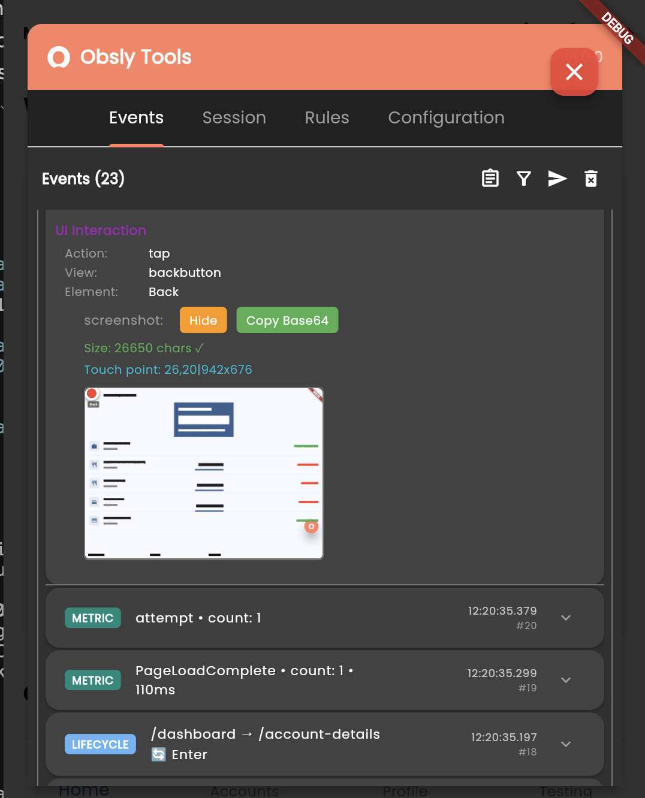
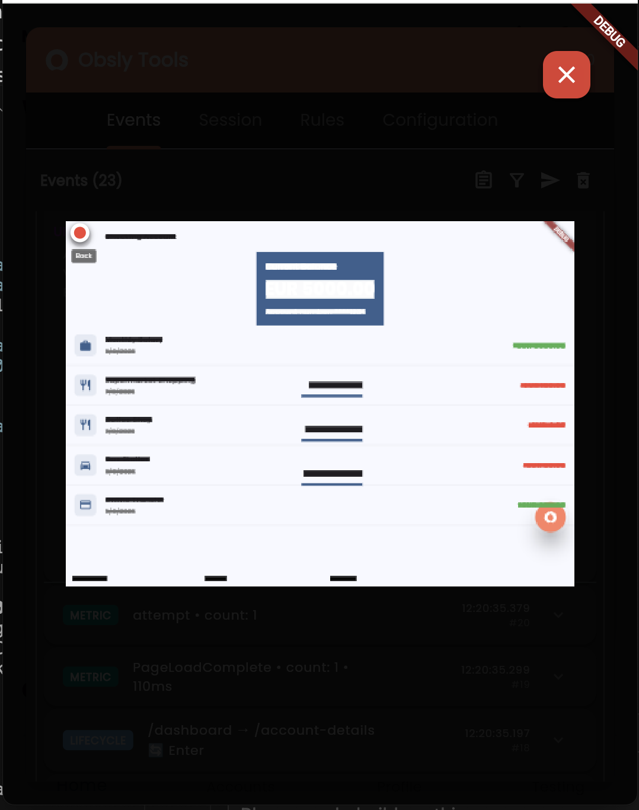
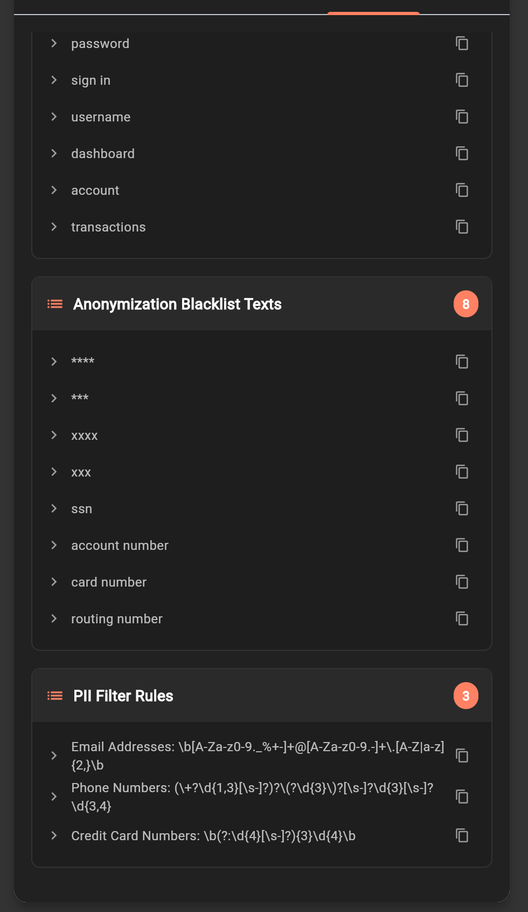

# Obsly Tools - Developer Debug Interface Guide

Complete guide to the Obsly Tools debugging interface, showcasing real-time monitoring, configuration management, and advanced analytics capabilities.

## Table of Contents

- [Overview](#overview)
- [Getting Started](#getting-started)
- [Banking App Implementation](#banking-app-implementation)
- [Events Tab](#events-tab)
- [Session Tab](#session-tab)
- [Rules Tab](#rules-tab)
- [Configuration Tab](#configuration-tab)
- [Best Practices](#best-practices)

## Overview

Obsly Tools provides a comprehensive debugging interface that overlays on your Flutter application, offering real-time insights into event capture, session management, rules processing, and SDK configuration. This professional-grade debugging tool is designed for development teams who need deep visibility into their application's observability infrastructure.

### Key Features
- 🎯 **Real-time Event Monitoring** - Live event capture and inspection
- ⚙️ **Dynamic Configuration** - Runtime SDK configuration changes
- 🎛️ **Visual Rules Engine** - Drag-and-drop rule creation and testing
- 📊 **Session Analytics** - Comprehensive session tracking and analysis
- 🛡️ **Privacy Controls** - PII filtering and anonymization management
- 📱 **Multi-platform Support** - Works across Web, iOS, Android, and Desktop

## Getting Started

### Accessing Obsly Tools

Obsly Tools appears as an overlay interface on your Flutter application when debug mode is enabled:

```dart
await ObslySDK.instance.init(InitParameters(
  obslyKey: 'your-api-key',
  instanceURL: 'https://api.obsly.io',
  config: ObslyConfig(
    enableDebugTools: true, // Enable debug interface
  ),
));
```

### Interface Overview

The Obsly Tools interface features four main tabs:
- **Events** - Real-time event monitoring and inspection
- **Session** - Session information and analytics
- **Rules** - Rules engine management and testing
- **Configuration** - Runtime SDK configuration

## Banking App Implementation

This section demonstrates Obsly Tools integration in a real-world banking application, showcasing how the SDK captures user interactions, maintains privacy through anonymization, and provides comprehensive debugging capabilities.

### Banking App Login Screen


The banking app login screen demonstrates:

#### Professional UI Design
- **Clean Interface**: Modern material design with rounded input fields
- **Branding**: "My Bank" header with consistent styling
- **Authentication Fields**: Email and password input with secure handling
- **Call-to-Action**: Prominent "Sign In" button for user authentication

#### Obsly Integration Features
- **Debug Indicator**: Red "DEBUG" badge in top-right corner indicating development mode
- **Event Capture**: All UI interactions automatically captured for analysis
- **Privacy Protection**: Sensitive input fields protected through PII filtering
- **Screen Timing**: Automatic page load timing measurement for performance analysis

#### Development Benefits
- **Real-time Monitoring**: All login attempts and user interactions tracked
- **Error Detection**: Failed authentication attempts automatically captured
- **Performance Metrics**: Login flow timing and optimization insights
- **Security Auditing**: Comprehensive logging for security compliance

### Banking App Dashboard


The main dashboard showcases comprehensive financial data with Obsly monitoring:

#### Financial Interface Elements
- **Welcome Message**: Personalized greeting for "Theuser"
- **Total Balance**: €45000.00 prominently displayed with proper formatting
- **Account Overview**: Three account types with masked account numbers:
  - **Checking Account**: ****1234 - EUR 5000.00
  - **Savings Account**: ****5678 - EUR 15000.00  
  - **Investment Account**: ****9876 - EUR 25000.00

#### Quick Actions Section
Four primary banking functions with intuitive icons:
- **Transfer**: Blue arrow icon for money transfers
- **Pay Bills**: Orange card icon for bill payments
- **Piggy Banks**: Green piggy bank icon for savings goals
- **More**: Gray dots icon for additional features

#### Credit Cards Display
- **Visa Card**: Blue gradient card design
- **Mastercard**: Partially visible second card option

#### Privacy and Security Features
- **Data Anonymization**: Account numbers automatically masked (****)
- **PII Protection**: Sensitive financial data protected from capture
- **Secure Monitoring**: Transaction monitoring without exposing sensitive details
- **Compliance Ready**: Built-in privacy controls for financial regulation compliance

### Obsly Tools Debug Interface


The Obsly Tools debug interface overlays the banking application, providing real-time development insights:

#### Event Monitoring Display
- **Current Session**: Session ID `a141e111...` with 35 captured events
- **Event Timeline**: Real-time event capture with precise timestamps
- **Event Types**: Mixed UI interactions, lifecycle events, and metrics

#### Banking-Specific Event Capture
- **UI Interactions**: `tap • Back`, `tap • account_tap_*` for account selections
- **Navigation Events**: `/dashboard → /account-details` route transitions
- **Performance Metrics**: 
  - `operation_duration • count: 1 • 1172ms` - Operation timing
  - `PageLoadComplete • count: 1 • 89ms` - Page load performance
- **Lifecycle Tracking**: App foreground/background state changes

#### Session Management
- **Active Session**: Current session with expandable event list
- **Export Controls**: Blue send and red delete buttons for session management
- **Event Filtering**: Real-time event inspection and debugging

> **📤 CRITICAL**: With debug tools enabled (`enableDebugTools: true`), **automatic sending is DISABLED**. To see events in the Obsly platform, **you MUST click the blue "Send" button (📤)** in the active session.

### UI Screenshot Capture



Advanced screenshot capture functionality demonstrates automatic UI documentation:

#### Screenshot Metadata
- **Touch Point Tracking**: Precise coordinate capture (26,20|942x676)
- **Screenshot Size**: 26650 characters for comprehensive capture
- **Export Options**: 
  - **Hide**: Conceal screenshot for privacy
  - **Copy Base64**: Export screenshot data for analysis

#### Banking Interface Screenshot
The captured screenshot shows:
- **Application State**: Dashboard view with navigation completed
- **UI Elements**: All interface components preserved in screenshot
- **User Interactions**: Visual record of user tap locations
- **Screen Context**: Complete application state at interaction moment

#### Development Applications
- **Bug Reproduction**: Visual evidence of issues and user flows
- **UI Testing**: Automated screenshot comparison for regression testing
- **User Experience Analysis**: Visual user journey documentation
- **Support Documentation**: Automated creation of help materials

### Anonymized Data Protection



Comprehensive data anonymization ensuring financial privacy compliance:

#### Anonymization in Practice
The screenshot demonstrates banking-specific privacy protection:
- **Financial Data**: Account balances and numbers automatically anonymized
- **Personal Information**: User names and identifiers protected
- **Transaction Details**: Sensitive transaction data filtered
- **Navigation Paths**: Screen transitions captured without exposing data

#### UI Interaction Event
- **Action Type**: `tap` interaction captured
- **Element Target**: `backbutton` navigation element
- **View Context**: `Back` button interaction on account details screen
- **Screenshot Protection**: Visual elements appropriately anonymized

#### Anonymization Features
- **Automatic PII Filtering**: Real-time sensitive data detection and masking
- **Banking Compliance**: Pre-configured rules for financial data protection
- **Custom Filter Rules**: Configurable anonymization patterns
- **Visual Anonymization**: Screenshot-level privacy protection

#### Regulatory Compliance
- **GDPR Ready**: European privacy regulation compliance
- **PCI DSS**: Payment card industry data security standards
- **SOX Compliance**: Financial reporting and audit trail requirements
- **Custom Regulations**: Adaptable for regional banking requirements

## Events Tab

### Real-time Event Monitoring


The Events tab provides comprehensive real-time monitoring of all captured events:

#### Current Session Display
- **Session ID**: Unique identifier for the current session (e.g., `1084c06a...`)
- **Event Count**: Real-time counter showing total events captured
- **Session Status**: `CURRENT` indicator for active sessions

#### Automatic Event Capture
Obsly automatically captures various event types:

**Lifecycle Events**:
- `home • foreground` - App coming to foreground
- `home • background` - App going to background  
- `home • appear` - Screen/view appearing
- Precise timestamps (e.g., `11:58:01.585`)

**HTTP Events**:
- `GET api.escuelajs.co/api/v1/products` - Network requests
- Request/response timing and status codes

### Event Filtering and Search


Advanced filtering capabilities include:

#### Search Functionality
- **JSON Content Search**: Search within event data structure
- **Real-time Filtering**: Instant results as you type

#### Event Type Filters
- **HTTP Filter**: Show only network-related events
- **Lifecycle Filter**: Show only app lifecycle events
- **All/None Options**: Quick selection controls

#### Session Management
- **Current Session**: `1084c06a...` with event count
- **Export Controls**: Send and delete session data
- **Session Expansion**: Collapsible session views

### Event Detail Inspection


Detailed event inspection provides comprehensive information:

#### Event Metadata
- **Type**: Event classification (e.g., `lifecycle (5)`)
- **Session ID**: Full session identifier
- **Sequence**: Event ordering number
- **Timestamp**: Precise timing (`12:02:31.062`)

#### Device Information
```
DEVICE:
- name: Chrome 139.0
- manufacturer: Google
- form_factor: desktop
- os_name: Web
- os_version: MacIntel
- emulated: false
- architecture: MacIntel
- network_type: wifi
```

#### Application Context
```
APP:
- start_time: 1757410576692
- bundle_identifier: demo_app
- name: demo_app
- version: 1.0.0
- platform: Web
- environment: DEBUG
- sdk_obsly: 1.0.0
- build_number: 1
```

#### Lifecycle Details
```
Lifecycle:
- Stage: foreground
- View: home
```

#### Export Functionality
- **Copy Full Event**: Export complete event JSON
- **Event Sharing**: Share event data for debugging

## Session Tab

### Session Information Overview


The Session tab provides comprehensive session tracking and analytics:

#### Session Identifiers
- **Session ID**: `1084c06a-827f-4f92-b684-48c3d247850b`
- **Installation ID**: `bdd22c80-1483-43f1-b7bc-6798f98be1c4`
- **Execution ID**: `7b4a5660-34e7-4084-8ae9-902e03eca161`

#### Device Information
- **Device Name**: Chrome 139.0
- **Manufacturer**: Google
- **Architecture**: MacIntel
- **Form Factor**: desktop
- **Emulated**: false

#### Application Details
- **App Name**: demo_app
- **Version**: 1.0.0
- **Platform**: Web
- **Environment**: DEBUG
- **SDK Obsly**: 1.0.0
- **Start Time**: 2025-09-09T11:36:16.692 (1757410576692)

### Session Analytics


Advanced session management features:

#### Event Overview
- **Current Session**: Real-time session tracking
- **Event Count**: Live counter (9 events shown)
- **Session Status**: Active session indicator

#### Search and Filtering
- **JSON Search**: Search within event content
- **Event Type Filters**: HTTP and Lifecycle toggles
- **All/None Selection**: Quick filter controls

#### Session Controls
- **Export Session**: Send session data - **REQUIRED to see events in platform!**
- **Delete Session**: Clear session events
- **Session Expansion**: View/hide session details

> **⚠️ IMPORTANT NOTE**: In debug mode, events are captured but NOT sent automatically. Use the "Send" button to transmit events to the Obsly platform.

## Rules Tab

### Rules Engine Management


The Rules tab provides comprehensive rules engine management:

#### Rules Engine Controls
- **Enable/Disable Toggle**: Runtime rules engine control
- **Rules Monitor**: Show/hide rules execution monitoring
- **Management Icons**: Refresh, download, and export controls

#### Rule Statistics
- **Total Rules**: `1` - Total rules in system
- **Remote Rules**: `0` - Server-side rules
- **Manual Rules**: `1` - Locally defined rules

#### Active Rules List
- **Rule Name**: "user presses login button, we send a tag"
- **Rule Type**: Manual rule indicator
- **Creation Date**: Added 9/9/2025
- **Rule Actions**: Edit and management options

#### Rule Management
- **Add Rule Button**: Create new rules
- **Rule Categories**: Organization and classification
- **Rule Status**: Active/inactive indicators

### Visual Rule Creation


Advanced rule creation and testing:

#### Rule Definition
- **Classification**: Rule categorization (ui, navigation, analytics)
- **JSON Editor**: Code-based rule definition
- **Paste Rule**: Import rules from clipboard

#### Rule Testing
```json
{
  "definition": {
    "k1pEC27ZUe": {
      "x": 230,
      "y": -300,
      "type": "doActions",
      "width": 200,
      "connections": {
        "inputs": {
          "tag1": []
        }
      }
    }
  }
}
```

#### Test Results
- **Execution Status**: "Rule executed successfully"
- **Generated Tags**: `theuser (EVENT): pressed: login`
- **Rule Output**: JSON response preview
- **Performance**: Execution timing and results

#### Advanced Rule Features
- **Test Rule**: Real-time rule validation
- **Create Rule**: Finalize and deploy rules
- **Rule Preview**: See rule effects before deployment

### Enterprise Rule Builder


Professional visual rule builder interface:

#### Workflow Design
- **Visual Nodes**: Drag-and-drop rule components
- **Flow Connections**: Visual rule logic connections
- **Node Types**:
  - **Check Click Control**: UI interaction detection
  - **Create Tag**: Tag generation actions
  - **End of Workflow**: Completion nodes

#### Rule Components
- **Controls**: `login_button` ID targeting
- **Tags**: Category assignment (theuser)
- **Variables**: Dynamic data handling
- **Actions**: Execution logic
- **Metrics**: Performance tracking

#### Configuration Options
- **Tag Type**: Event classification
- **Dictionary**: Key-value pair management
- **Category**: Rule organization
- **Value Assignment**: Dynamic data binding

## Configuration Tab

### Configuration Management


Comprehensive SDK configuration management:

#### Current Configuration
- **Generate Button**: Create configuration code
- **Configuration Export**: Copy and share settings
- **Real-time Updates**: Immediate configuration changes

#### Remote Configuration Status
- **Status**: Connection state monitoring
- **Error Handling**: "Failed to fetch remote config"
- **Cache Management**: Local configuration fallback
- **Sync Status**: Remote/local configuration coordination

#### Configuration Sources
- **Default Settings**: `18` - SDK default configuration
- **Local Overrides**: `2` - Local customizations
- **Remote Settings**: `0` - Server-side configuration

### Feature Configuration


Detailed feature configuration interface:

#### Configuration Modes
- **Development**: Full debugging and monitoring
- **Production**: Optimized for performance
- **Custom**: User-defined configuration

#### UI & Screenshots Settings
- **Enable Screenshots on UI Events**: Automatic screenshot capture
- **Enable UI Event Tracking**: User interaction monitoring
- **Automatic View Detection**: Screen transition tracking

#### Event Tracking Controls
- **Crash Events**: Exception and error tracking
- **Performance Events**: Performance metric monitoring
- **HTTP Request Events**: Network activity logging
- **Lifecycle Events**: App state change tracking
- **Tag Events**: Custom tagging system

#### Configuration States
All settings show clear **Enabled/Disabled** states with toggle controls for immediate configuration changes.

### Code Generation


Automatic configuration code generation:

#### Code Export Options
- **Simple**: Basic configuration setup
- **Advanced**: Full configuration options
- **Config Only**: Configuration object only
- **JSON**: Raw configuration data

#### Generated Code Example
```dart
void main() {
  ObslySDK.run(() {
    runApp(ObslySDK.wrapApp(
      app: MyApp(),
      obslyKey: 'YOUR_API_KEY',
      instanceURL: 'https://your-obsly-instance.com',
      config: ObslyConfig.withDefaults(
        anonymization: const AnonymizationConfig(
          enablePiiFiltering: true,
        ),
      ),
    ));
  });
}
```

#### Export Features
- **Copy to Clipboard**: One-click code copying
- **Live Preview**: Real-time code generation
- **Multiple Formats**: Various export options

### Advanced Configuration



Enterprise-grade configuration management:

#### UI & Screenshots Configuration
- **Screenshot on UI**: Disabled (Default)
- **Debug Tools**: Enabled (Local)
- **Rage Click Active**: Enabled (Local)
- **Rage Click Screenshot**: Enabled (Local)
- **Screenshot Percent**: 25% (Local)

#### Event Tracking Status
- **Crashes**: Enabled - Exception monitoring active

#### Anonymization Management
**Anonymization Blacklist Texts** (8 configured):
- `password` - Credential protection
- `sign in` - Authentication data
- `username` - User identification
- `dashboard` - Navigation protection
- `account` - Account information
- `transactions` - Financial data
- `****` - Generic sensitive patterns
- `xxx` - Placeholder protection
- `XXXX` - Uppercase patterns
- `ssn` - Social Security Numbers
- `account number` - Financial identifiers
- `card number` - Payment information
- `routing number` - Banking details

#### PII Filter Rules (3 configured):
- **Email Addresses**: `\b[A-Za-z0-9._%+-]+@[A-Za-z0-9.-]+\.[A-Z|a-z]{2,}\b`
- **Phone Numbers**: `(\+?\d{1,3}[\s-]?)?\(?[\d{3}\)?[\s-]?\d{3}[\s-]?\d{4}`
- **Credit Card Numbers**: `\b(?:\d{4}[\s-]?){3}\d{4}\b`

## Best Practices

### Development Workflow

1. **Enable Debug Tools**:
   ```dart
   config: ObslyConfig(
     enableDebugTools: true, // Only in development
   )
   ```

2. **Monitor Events in Real-time**:
   - Use Events tab to verify event capture
   - Check event structure and metadata
   - Validate timing and sequencing

3. **Test Rules Before Deployment**:
   - Create rules in the Rules tab
   - Use Test Rule functionality
   - Verify rule output and performance

4. **Configure Privacy Settings**:
   - Set up PII filtering rules
   - Configure anonymization blacklists
   - Test data protection in development

### Production Considerations

1. **Disable Debug Tools**:
   ```dart
   config: ObslyConfig(
     enableDebugTools: false, // Always false in production
   )
   ```

2. **Optimize Configuration**:
   - Use Production configuration mode
   - Minimize screenshot capture
   - Configure appropriate rate limiting

3. **Privacy Compliance**:
   - Enable PII filtering
   - Configure anonymization rules
   - Regular privacy audits

### Performance Optimization

1. **Event Management**:
   - Monitor event volume in Events tab
   - Configure appropriate filtering
   - Use session analytics for optimization

2. **Configuration Tuning**:
   - Use Configuration tab for runtime adjustments
   - Monitor performance impact
   - Optimize for your use case

### Troubleshooting

1. **Event Issues**:
   - Check Events tab for event capture
   - Verify event structure and timing
   - Use event filtering for debugging

2. **Configuration Problems**:
   - Review Configuration tab status
   - Check remote configuration connectivity
   - Verify local override settings

3. **Rules Debugging**:
   - Use Rules tab test functionality
   - Monitor rule execution results
   - Check rule performance metrics

## Conclusion

Obsly Tools provides enterprise-grade debugging and monitoring capabilities for Flutter applications. With comprehensive event monitoring, visual rules creation, dynamic configuration management, and advanced privacy controls, development teams can ensure optimal observability implementation while maintaining performance and privacy standards.

The interface combines professional debugging tools with user-friendly design, making complex observability features accessible to development teams of all skill levels. Whether you're implementing basic event tracking or advanced rules-based analytics, Obsly Tools provides the visibility and control needed for successful observability implementation.

For additional support and advanced features, contact [help@obsly.io](mailto:help@obsly.io).
